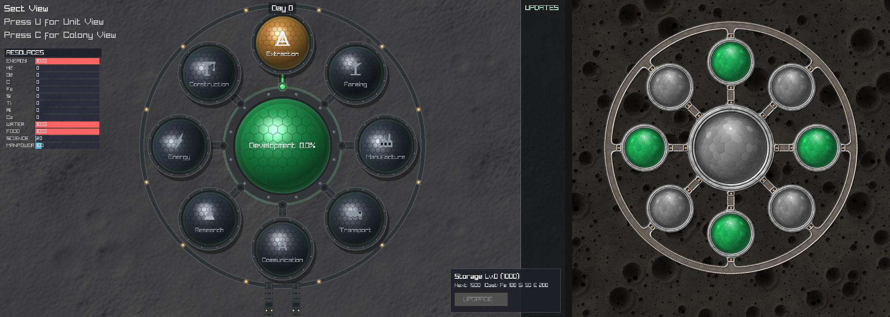
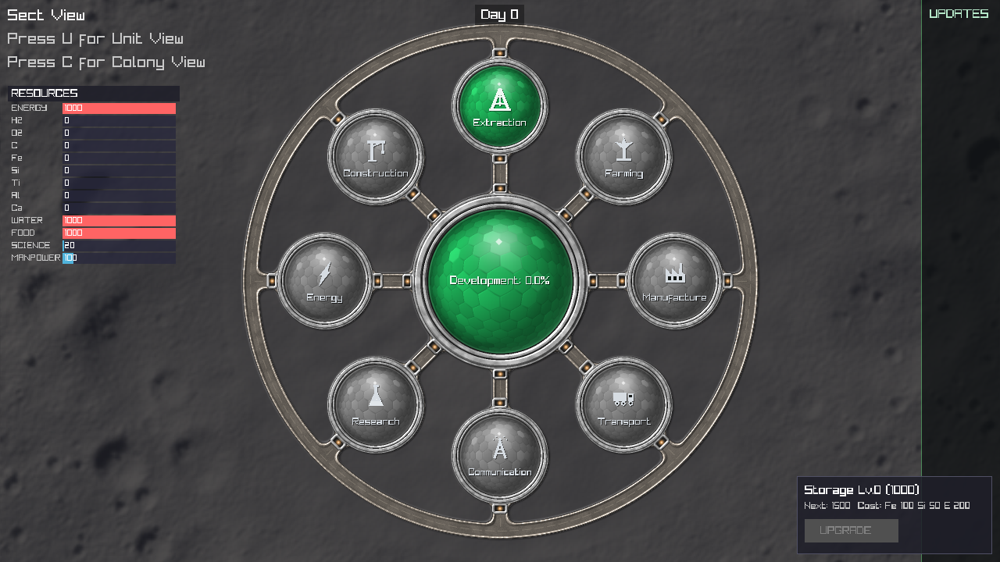
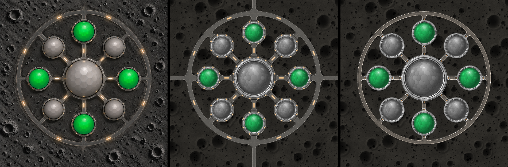
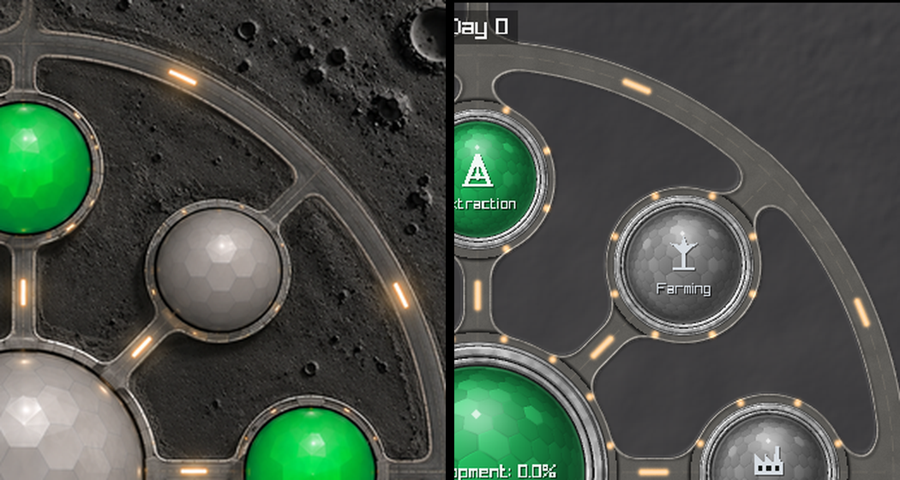
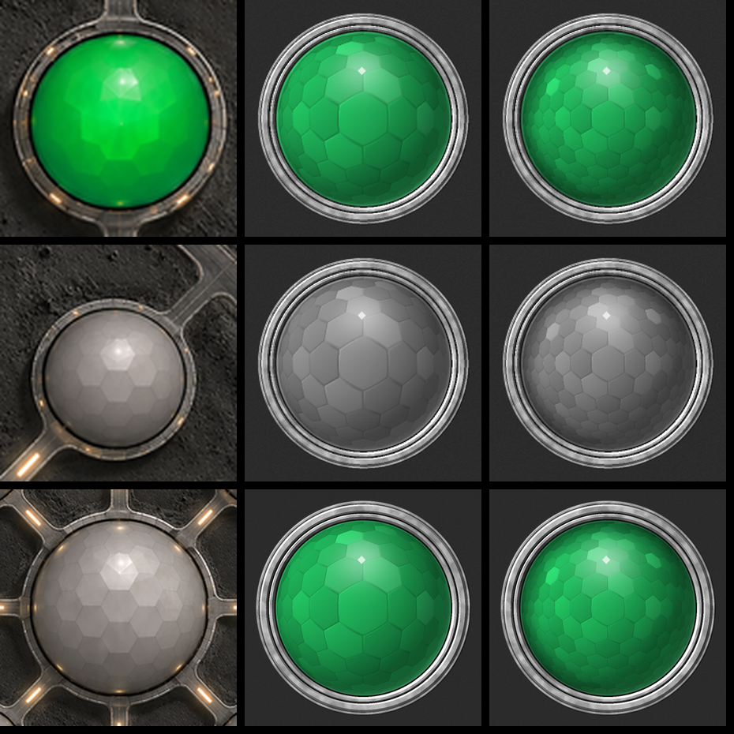
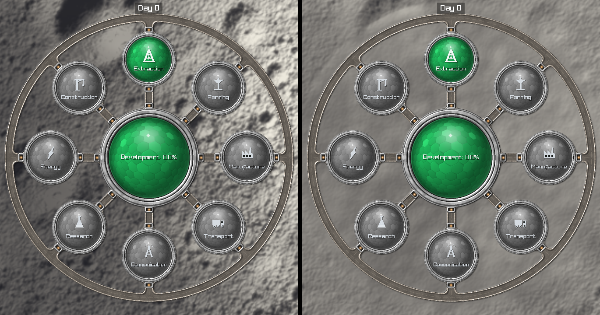

# DomeForge → Sect view: study and port plan

**Status: IMPLEMENTED (2D), 3D sized and scaffolded.** The sect view draws
the DomeForge base (§6). This document records what DomeForge is, how it maps
onto the sect view, what was decided (§5) and what was built (§6-§8).

Source: [`prototypes/dome-forge/`](../../../prototypes/dome-forge/), the
user's procedural generator for the lunar-base art set. Its own README is the
full reference. `dome-forge.html` inlines the three `.js` files **line for
line** (verified), so the `.js` files are the canonical source. Port those
once, not the HTML.

*Left: the sect view before (Mare Imbrium). Right: DomeForge's
`lunar-base-full.png`. The result is at the end of §6.*

---

## 1. What DomeForge is

Three renderers driven by **one plain config object** (88 engine parameters +
49 base parameters, all with defaults):

| File | Renders | How |
|---|---|---|
| `dome-forge-engine.js` (690 lines) | one dome sprite, `unit` or `central`, and the sprite sheet | per-pixel SDF shading into an RGBA buffer, 2×2 SSAA |
| `dome-forge-base.js` (279 lines) | ground, roads, and the full base assembly | the same approach: road union SDF, cratered regolith, domes blitted from a cache |
| `dome-forge-3d.js` (690 lines) | the base or one dome in 3D | one WebGL 1 fragment shader that ray-marches the scene |

The properties that matter for porting:

- **It is not Canvas 2D.** No paths, no gradients, no `shadowBlur`. Every pixel
  is computed from signed-distance fields, and the only Canvas call puts the
  finished buffer on screen. So the c2d kit
  ([`js-graphics-port.md`](../../guides/js-graphics-port.md)) does **not**
  apply. Its *method* does: verbatim source, reference renders and a pixel
  diff gate.
- **Deterministic.** All randomness goes through a seeded integer hash
  (`hashInt`, `Math.imul`-based), so it maps exactly onto `uint32_t`. Given
  the same config, a C port can reproduce the JS almost bit for bit. Use
  `double` where the JS does arithmetic, so float64 rounding doesn't drift.
- **Headless reference renders already exist.**
  `node examples/render.js unit|central|sheet|base [scale] [json]` writes PNGs
  with no browser. Measured here: unit 256 px in 0.4 s, central 560 px in
  1.4 s, base at half size in 3.4 s.
- **Built to be baked.** `renderBase` already caches sprites by
  `(kind, size, colour, sockets, socket angle)`. That's the same pattern as the
  game's current `GetBakedDomeTexture`.
- **The 3D shader is portable.** GLSL ES 1.0 with no textures, no extensions
  and only constant loop bounds. raylib can load it as a fragment shader
  (`#version 100` on web, a small header swap for GL 3.3 on desktop).

## 2. Element by element: today → DomeForge

The layout is the same idea (a central dome, eight unit domes at 45° steps, a
ring road). What's drawn differs:

| Sect view today (`Sect::DrawInSectView`) | DomeForge | Note |
|---|---|---|
| Core: ray-shaded green sphere + hex glass (`DrawDomeSphere`) | `central` sprite: hex cells on a sphere, plate rim, 8 sockets; optional polygon rim (`central.sides`) | DomeForge's glass is much richer: faceted cells, glint, bounce light, contact shadow |
| 8 unit domes with procedural glyph + label (`DrawUnitDomeStation`) | `unit` sprite, 2 sockets (toward centre + toward ring road) | DomeForge has **no icons or labels**. It colours cardinal vs diagonal domes only |
| Connector arms with green conduit + LED sockets (`DrawConnectorArm`, `DrawSocket`) | road spokes centre → dome → ring road, merged into the rims; cavity lights in the socket loops | LED status maps naturally onto the **socket cavity light colour** |
| Ring road with lamp seams (`DrawRingRoad`) | kerbed ring road, filleted into the spokes, dashed lane line | |
| Entry rails at the bottom (`DrawEntryRail`) | none (`spokesBeyond` extends the cardinal spokes instead) | decision needed |
| Background: real-imagery terrain (`DrawSectTerrainBackground`) | its own cratered regolith (`renderGround`) | **keep the real terrain.** `baseView: 'roads'` and `renderRoads` give the road layer without the ground |
| Selection: the selected unit dome turns amber | none | a glass colour per state is one config field (`color`) |
| "Development: N%" drawn over the core | none | keep as overlay text |
| Hit testing via `SetUnitPosInSectView` / radius | positions from `layout()` | keep the game's hit tests and feed them DomeForge's layout |

Layout constants for comparison. DomeForge is in px at a 1254 px base; the
game is in fractions of screen height `h`:

| | DomeForge | as a fraction of the base | game today |
|---|---|---|---|
| unit orbit radius | 340 | 0.271 | 0.325 h |
| ring road radius | 485 | 0.387 | 0.443 h |
| central sprite size | 475 | 0.379 | core radius 0.15 h |
| unit sprite size | 236 | 0.188 | unit radius 0.085 h |
| vertical offset | −42 | | −0.04 h |

## 3. Port approach

**Recommended: a C port of the engine and the road layer, baked to textures.**

1. `src/DomeForge/` (C or C++, following the module-architecture guide):
   `domeforge_config` (DEFAULTS as a struct), `domeforge_engine` (render
   unit/central → RGBA), `domeforge_base` (layout + roads; ground optional).
   Translate function by function with the same names, the same order and the
   same arithmetic, in `double`.
2. Bake at sect load, keyed like `renderBase`'s cache. Sizes follow the display
   scale (1×–3×), so a 3× screen bakes about a 650 px central sprite. Budget
   the bake and cache it; never render per frame.
3. `Sect::DrawInSectView` draws the baked road layer and dome textures over the
   real terrain, then the game overlays (development %, labels, selection,
   hover).

Alternatives, and why they aren't first:

- **Shader port of the 2D engine.** Live lighting and animated socket lights
  for free, but it's harder to diff and costs GPU every frame on phones. A good
  second step once the CPU port is the reference.
- **The 3D viewer as a raylib shader.** Nearly a direct lift. Worth doing for a
  tilted or hero view of the sect, but it's a new camera mode, not a
  replacement for the top-down view.
- **Pre-rendered PNGs from node.** The quickest route, but it freezes colours,
  states and sizes into assets, and the game needs those to vary at runtime.
  Fallback only.

## 4. Verification

The same shape of gate as the c2d kit, with a tighter target because the
arithmetic is shared rather than approximated:

- **Reference:** `node prototypes/dome-forge/examples/render.js <kind> '<json>'`
  at a fixed config.
- **Port:** a small driver that renders the same kind and config through the C
  engine to PNG.
- **Diff:** `diff.py`, from the c2d kit's `tools/visdiff/` or copied. Target
  **under 1%** differing pixels. Expect near zero, because the math is
  identical, not approximated.
- **In context:** `tools/preview/preview.sh --view sect`, looked at every time.

## 5. Decisions (the user, 2026-09-25)

1. **Colour = state.** Green glass means on, grey means off. Keep a place to
   set a colour per unit, but don't build it yet: `DomeColour` in
   `sect_art.cpp` takes the slot and is the one place it would go.
2. **Unit identity stays on the glass** (glyph + label), for now.
3. **Real ground**, with the feel of levelled ground immediately under the
   site, as a construction site would have. See §8. It is not a pad: a built
   platform was tried and rejected before (`SITE_SYNTHESIS.md`).
4. **No entry rails.**
5. **Round rims** (`central.sides = 0`).
6. **3D: wanted eventually.** Estimate what it adds first; if too much, lay
   out the structure without fully developing it. See §7.

## 6. What was built

| Piece | Where | Check |
|---|---|---|
| DomeForge engine + base, a 1:1 port in C++ (double precision, JS rounding reproduced) | `src/DomeForge/` | `tools/domeforge/domeforge_diff.sh`: unit, 2-socket off-grey unit, central, roads, ground and the full base all **100% pixel-identical** to the JS (roads/base: max difference 1/255) |
| Row-at-a-time jobs, so a bake can be spread over frames | `DomeForgeJob` in `domeforge.h` | the same diff: the refactor and the road-span skip changed no pixel |
| The sect view's art: one set per game, baked a slice per frame from startup (6 ms), placed at its real size | `src/Sect/sect_art.{h,cpp}`, `Sect::DrawInSectView`, `Engine::Update` | about 1.15 s of CPU for the whole set at 1280x720, -O2 (road layer 445 ms, core 138 ms, 16 unit domes 562 ms): done about 3 s after boot at 60 fps |
| Ground levelled under the base | `SectLevelSite` + footprint in `terrain_synthesis.{h,cpp}` and `terrain_gpu.cpp` | §8 |
| Old dome stations retired | `docs/graveyard.md` §11 | |

Scale: the ring road's centre line is `SECT_RING_ROAD_KM` from the sect
centre (1.25 km at first; 1.10 km since §6c made room for the north road), on
the same 5 km ground the sect view cover-fits to the screen. That means the art, the
hit tests and the site levelling all agree about where the base is. DomeForge
files are compiled `-O2` in every build type (a debug build bakes ~5x slower
otherwise).

## 6b. Roads like the concept (the user, 2026-09-25)

*"You see the size of roads in the first concept image. I want it like
this."* The concept is DomeForge's own reference,
`samples/base-compare-reference.png` (left half). Measured before tuning,
the concept's roads are **not much wider** than DomeForge's defaults: where
both are plain road they are 13-16 px at 627 px. What makes them read
bigger and darker:

- **the kerb is a soft edge** (luminance ~130-140) where DomeForge draws a
  bright line (200-255) with a dark gutter beside it
- **the asphalt is smooth** and the spokes a darker grey (L 55-75)
- **smaller domes** (units ~82 px, core ~150 px at 627, against DomeForge's
  95 and 165), so more road shows between them
- **every dome sits in a collar of road** that the spokes flow into, with
  small lamps in it; amber bars sit on the centre lines; the cardinal roads
  run on past the ring and off the picture

Most of that is DomeForge's own parameters, set in `SectArt::BaseConfig()`
(road colour, mottle, kerb width, bevel, shine and outline, bank, fillets,
lane, dome sizes, sockets off). The rest are **extensions in the port**,
off by default so `domeforge_diff.sh` still matches the JS exactly:
`domeCollar`, `roadLights` (+ `ringLights`, `collarLights`,
`coreCollarLights`), and `spokesBeyondLen`. The road layer is screen-sized,
so roads can leave the base (§6c keeps only the north one). It was tuned
crop against crop at the same scale with
`domeforge_render --set key=value` (any field, by its JS name).

*Concept | tuned | DomeForge default, all on DomeForge's own ground.*

*The same quadrant: concept (left) and the game (right).* The remaining
difference is the ground: the concept's is dark stylised regolith, and the
game's is the real terrain, which is lighter, so the roads read a little
darker than the ground instead of lighter.

`tests/test_sect_site.cpp` now holds the levelled site to the art's layout
(ring road, dome ring, core, footprint), since the dome sizes moved and the
two once drifted apart.

## 6c. One exit road, and the glass (the user, 2026-09-25)

**Exit roads.** Only the north one stays: shorter, and fading into the
ground at its end. Two more port extensions, off by default:
`exitRoads` (a mask, N=1 W=2 S=4 E=8; 15 = all four, the JS) and
`exitFade` (the road's last N px fade out, along a noisy edge so it
dissolves instead of stopping on a line). The fade has to happen on
screen, and at 1.25 km the ring road's top edge sat 29 px from the top of a
720 px screen, under the "Day 0" label. So the base shrank to
`SECT_RING_ROAD_KM` = 1.10 km (the site levelling follows it, and
`test_sect_site.cpp` checks). The road runs 62 px past the ring's centre
line and fades over its last 40 (px at 1254), ending just short of the label.

**Glass.** Less shadow round the rim, and more curvature: big cells in the
middle shrinking toward the rim. `edgeShadow` 0.3 → 0.06 (width 0.25 →
0.12) and `limbDark` 0.42 → 0.2 take the rim shadow down. The curvature
comes from **`hexLens` 0.85** (perspective; `hexCells` 0.08), **not
`hexCurve`**. `hexCurve` raises the surface angle to a power, and above
about 1.5 it balloons the centre cell and drops straight to slivers
(tried: 1.9-2.2). Perspective shrinks the cells gradually, which is what the
concept shows.

*Green unit, grey unit and core: concept | tuned | before.*

## 6d. Lights, icons and labels (the user, 2026-09-25)

**Lights: "sharp but with bokeh".** At a few pixels across, the bars read as
flat, pale smudges and the collar lamps as blur. Each light is now a crisp
core (4x4 supersampled, white-hot along its centre line, amber at its edge),
a tight glow and a wide, faint bokeh halo spilling onto the road
(`roadLightHot`, `roadLightBloom`, `roadLightBloomR`; lamps 5 px at 1254).
These are extensions, so the JS parity gate is untouched.

**Icons.** The user's set, `prototypes/unit-icons/icons.js` (kept verbatim,
with `reference.webp`), is SVG built by JS templates on a 100x100 grid, ink
and knockout. Options weighed for raylib:

| Way | Verdict |
|---|---|
| Hand-port each icon to raylib draw calls | loses fidelity (arcs, round joins, knockouts), 8 hand translations to keep in sync |
| Pre-render PNGs from a browser | fixed sizes; blurs when the screen scale changes |
| **Run the JS, rasterise the SVG in-game with nanosvg** | chosen: exact shapes at any size, one generator |

`tools/unit_icons/gen_unit_icons.js` runs the JS (it has loops) and writes
`src/Sect/unit_icons_svg.h`; `src/Sect/unit_icons.cpp` rasterises with
nanosvg (`src/external/nanosvg`, zlib licence) at 3x and box-filters down,
then tints near-white with a soft shadow. Rasterised on first use per type
and size, then cached. The icons follow the JS where it differs from the
reference picture (the JS truck has three wheels and an outlined box).

**Labels.** No text on the domes; the unit's name shows on hover, in a small
label under the dome. raylib's default font is a pixel font, which is what
looked broken; the label and the core's readout now use a TrueType face
loaded at twice its drawn size with mipmaps and trilinear filtering. Three
candidates are in `src/assets/fonts/` for the user to choose from: Exo 2
Bold, Rajdhani SemiBold, Barlow SemiBold (`preview.sh --view sect --hover N
--label-font exo2|rajdhani|barlow`).

## 7. 3D view: sized, scaffolded, not built

`dome-forge-3d.js` is one WebGL 1 fragment shader, 444 lines / 20 KB of GLSL
ES 1.0 (no textures, no extensions, constant loop bounds), plus about 250 lines
of JS that pack uniforms and drive an orbit camera. Per pixel it marches up to
140 steps, then a 22-step soft shadow and ambient occlusion. Each step
evaluates up to 9 dome instances and 16 road segments.

| Cost | Size |
|---|---|
| Code | the shader nearly verbatim (a version prelude for GL 3.3 / ES 1.0) + ~250 lines C++ for uniforms and camera + a WebGL-vs-port diff harness (headless Chromium does WebGL) |
| Download | ~20 KB of shader text |
| **Runtime** | **a full-screen ray-march every frame.** Fine on a desktop GPU. The prototype's own README tells slow machines to render with 2-3x coarser pixels, and phones are the web build's main audience |
| Integration | a camera mode in the sect view (2D <-> 3D), orbit/zoom input, picking domes by ray-sphere, labels projected from 3D |

**Verdict: too much to finish now.** The port is small; the runtime cost on
phones is the risk, and it needs its own design (render only when the camera
moves, or at reduced resolution into a texture). The structure is in place:
`src/DomeForge/domeforge_3d.{h,cpp}` has the API it will have (Create /
SetBase / SetCamera / Render with a pixel-size escape hatch). `Create()`
returns false and logs that it isn't built, so nothing calls into an empty
renderer by mistake.

To build it: extract the fragment shader and its `#define P_*` prelude from
`dome-forge-3d.js`, port `setConfig`'s uniform packing, then gate it the same
way the 2D port was gated (the same config rendered by the prototype in
headless Chromium and by the port, diffed).

## 8. The ground under the base

What was there: `TerrainSiteDisturbance` levels the natural ground over the
whole site (0.70 of the elevation swings, 0.55 of the imagery contrast), then
works it. Its geometry is calibrated for the colony view. The sect level used
it scaled by 0.63, and measured with `preview.sh --no-site` against the
default, that put the effect **420-540 px from the centre of the sect view:
outside the ring road**, with the ground under the base untouched.

What it is now:

- `SectLevelSite` takes the 5 km level's geometry from the base's layout
  (the dome ring, the core and its collar, and a footprint out to the ring
  road's outer kerb -- all in proportion to `SECT_RING_ROAD_KM`).
- Inside the footprint the ground is levelled much further (elevation 0.92,
  tone 0.50) and the site's own undulation and roughness are calmed by 0.60.
  It fades back to the site treatment over 0.30 km: no edge.
- **Graded ground loses its relief, not its grain.** Levelling toward the mean
  also flattens the regolith grain, and the first attempt read as a smooth
  grey disc, which is exactly the rejected pad look. So whatever the footprint
  levels beyond the site's own amount, the grain and undulation get back. The
  CPU (`ApplySiteDisturbance`) and GPU (`heightCommon`) paths do the same
  thing, and outside the footprint nothing changes.

Measured with `terrain_probe` at Mare Imbrium, inside 1 km: coarse relief
(9-px blur, standard deviation) 9.0 → 2.3 on the GPU path.

*A rough highland site (-20, 15). Left: natural ground (`--no-site`). Right:
levelled under the base and fading back past the ring road.*
